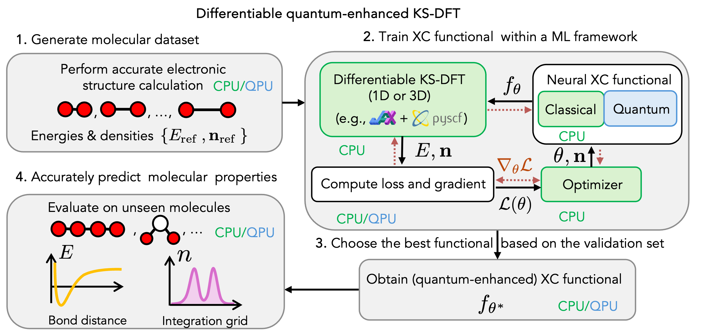

<p align="center">

</p>

# Quantum-Enhanced Density Functional Theory in JAX (QEX)

[](https://arxiv.org/abs/2404.14258)

## Overview

QEX is a quantum-enhanced implementation of Kohn-Sham Density Functional Theory (KS-DFT) in [JAX](https://github.com/google/jax), building upon the following packages:
- DFT in 1D: [JAX-DFT](https://github.com/google-research/google-research/tree/master/jax_dft) by Li Li et al., Phys. Rev. Lett. 126, 036401, 2021
- DFT in 3D: [PySCFAD](https://github.com/fishjojo/pyscfad) by X. Zhang et al., J. Chem. Phys., 157, 204801, 2022

The primary goal is to enable to train quantum(-enhanced) neural networks to approximate the universal exchange-correlation functional of KS-DFT.
It enables to reproduce the work:
- [Quantum-Enhanced Neural Exchange-Correlation Functionals](https://arxiv.org/abs/2404.14258) (Sokolov et al., arXiv:2404.14258, 2024), where we investigate the performance of the quantum(-enhanced) neural networks in 1D and then extend to the full 3D case.

QEX leverages JAX primitives for JIT compilation, automatic differentiation, and GPU acceleration for quantum emulators through [Qadence](https://github.com/pasqal-io/qadence) and [Horqrux](https://github.com/pasqal-io/horqrux), providing differentiable building blocks for DFT calculations that enable hybrid quantum-classical model in KS-DFT for electronic structure research.


<p align="center">

</p>

Visualization of the convergence of the electron density isosurfaces for the H2 molecule with the number of epochs:

<p align="center">

</p>


## Key Features

- Quantum-classical hybrid KS-DFT implementation
- Multiple quantum network architectures:
  - Basic and advanced quantum neural networks
  - Convolutional quantum models
  - Global and local quantum functionals
- GPU acceleration via JAX
- Automatic differentiation

## Prerequisites

- Python 3.10.16

## Installation

Clone the repository and then navigate to it and install the dependencies:

```bash
# Create and activate a virtual environment (optional but recommended)
python -m venv .venv
source .venv/bin/activate

# Install dependencies from requirements file
pip install -r requirements.txt

# Install the local package in editable mode
pip install -e .
```

For GPU acceleration, install instead the version of JAX with GPU support, e.g.:

```bash
# Adapt from official JAX website: https://github.com/google/jax#installation
pip install -U "jax[cuda12]"
```

## Usage Examples

Below are examples of how to run the training scripts for 1D and 3D systems. To reproduce the results from the paper, please refer to the `notebooks` folder. There one needs to increase the number of epochs and change the number neurons / qubits and layers as in our paper. The default settings are just for demonstration purposes.

### Training XC Model in the 1D Kohn-Sham DFT Framework

This command runs the example training script for a 1D quantum system.
The user can define their own network by inheriting from the `KohnShamNetwork`, basically by implementing the `build_network` method for their specific `network` that returns `(init_fn, apply_fn)`.

```python
import os
import qedft
from qedft.models.networks import LocalMLP, LocalQNN
from qedft.config.config import Config
from pathlib import Path
from qedft.train.od.trainer import KSDFTTrainer
from loguru import logger


# Get project path
project_path = Path(os.path.dirname(os.path.dirname(qedft.__file__)))

# Load base configuration
config = Config(config_path=project_path / 'qedft' / 'config' / 'train_config.yaml').config

# The network object has the function `build_network` that returns (init_fn, apply_fn),
# init_fn takes a PRNGKey and input_shape and returns initial parameters,
# apply_fn takes parameters and inputs and returns network outputs
network = LocalMLP(config)

# Initialize trainer
trainer = KSDFTTrainer(
    config_dict=config,
    network=network,
    data_path=project_path / 'data' / 'od'
)

# Train model
params, loss, info = trainer.train(
    # checkpoint_path=project_path / 'tests' / 'ckpts' / 'ckpt-00001',
    checkpoint_save_dir=project_path / 'tests' / 'ckpts'
)
```
*(Note: See also `qedft/train/od/train.py` for the 1D training script)*

### Training XC Model in the 3D Kohn-Sham DFT Framework

Similarly, this command runs the example training script for KS-DFT in 3D, for the H2 molecule:

```python
import os
import qedft
from qedft.models.networks import GlobalMLP
from qedft.config.config import Config
from pathlib import Path
import jax.numpy as jnp
from qedft.train.td.trainer_legacy_no_jit import TDKSDFTTrainer
from qedft.models.networks import GlobalMLP
from qedft.train.td.stax_to_flax_network import adapt_stax_for_training
from loguru import logger


# Get project path
project_path = Path(os.path.dirname(os.path.dirname(qedft.__file__)))


# Create H2 bonds example
config = {
    "features": [512, 512, 1],
    "train_bond_lengths": [0.74, 0.5, 1.5],
    "val_bond_lengths": [0.6, 0.9, 1.2],
    "n_iterations": 100,  # Small for testing
    "batch_size": 3,
    "is_global_xc": True,
    "results_dir": "results/h2_test_run",
}

# Initialize network with STAX and then convert to Flax
model = GlobalMLP()
num_grid_points = 1192
network_stax = model.build_network(grids=jnp.linspace(0, 1, num_grid_points))
stax_init_fn, stax_apply_fn = network_stax  # your STAX model
network, params = adapt_stax_for_training(stax_init_fn, stax_apply_fn, (num_grid_points,))
logger.info(f"Network initialized with {num_grid_points} grid points")

# Initialize and train
trainer = TDKSDFTTrainer(config, network=network)
params, opt_state, train_losses, val_losses, val_iters = trainer.train()
```
*(Note: See also `qedft/train/td/train_legacy_no_jit.py` for the 3D training script)*

These scripts will typically:
1. Generate or load training/testing/validation data.
2. Initialize the neural network model (classical or quantum-enhanced).
3. Run the training loop, optimizing the model parameters.
4. Save checkpoints and final model parameters.
5. Output logs and results.

## Limitations & Future Work

- For now, the 1D implementation can be fully jitted and parallelized (KS-DFT and XC model), while the 3D implementation only the network is jitted. We implemented so far exactly what was in the original [paper](https://arxiv.org/abs/2404.14258) (Sokolov et al., arXiv:2404.14258, 2024).
- In future, we will add a fully vectorized 3D implementation that can be trained on a large dataset.

## Citation

If you use this code in your research, please cite:

```bibtex
@article{sokolov2024quantum,
  title={Quantum-Enhanced Neural Exchange-Correlation Functionals},
  author={Sokolov, Igor O and Both, Gert-Jan and Bochevarov, Art D and Dub, Pavel A and Levine, Daniel S and Brown, Christopher T and Acheche, Shaheen and Barkoutsos, Panagiotis Kl and Elfving, Vincent E},
  journal={arXiv preprint arXiv:2404.14258},
  year={2024}
}
```

## License

QEX is a free and open source software package, released under the PASQAL OPEN-SOURCE SOFTWARE LICENSE (MIT-derived).
